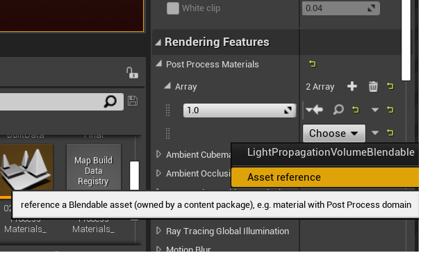

# UE4 Shaders And Effects Learning Notes

## Chapter 2 

### 1. 关于色温？

概括的介绍：超过5000k的为冷色，低于5000k的为暖色。

蜡烛灯光一般为1800k，灯泡为3200k

### 2. 借助景深设置影院级的画面？
本节制作的立足点为影院相机（cinematic camera）的聚焦。

UE中post processing effect功能在post processing volume和camera中均有分布。

相机所关联的可视效果为和演员对象直接关联的最直接效果。相机的设置也和真实相机一样选项繁多。

CineCameraActor和PostPorcessingEffectActor共享几乎相同的设置，（他们在某些功能上殊途同归）。

#### 使用CineCameraActor和PostProcessingEffectActor的区别？
使用CineCameraActor可以设置相机（及参数）类型，以及某些相机内部设置。包括：FStop，Diagram blade count，apertures of lens。
而使用PostProceessingEffect无法设置相机相关的参数，但是在确定选定空间体的优先级，以及和临近区域的混合方式中更有优势。

#### 如何调整camera调出聚焦辅助平面？
在相机DetailPanel面板中->Current Camera Setting->Focus Setting->Draw Debug Focus Plane。也就是说在Focus Plane是一种调试辅助手段。
Focus Plane的本质是提供一种可视线索，用于辅助设置物体和相机之间的距离。

#### 基于camera和Post processing volume的post processing effect的使用场合。
基于camera的后处理效果，通常用于特定的玩家相机，也即是特定角度的呈现。
而基于Post Processing Volume的效果则基于主界面。通常用于整个open world的后处理效果改变。比如，场景外观的色彩变化。

### 3. 如何应用影院效果（到游戏中）？
基于相机使用后处理效果，是获得影院效果的直接有效方式。

#### 1. 如何设置暗角（vignetting)效果？
在相机的detail panel中，寻找post processing effect->Lens分类->Image effect->vignetting effect

##### Vignetting效果定义？
一种微妙效果，可使得图像中心周围的区域比中心区域更暗。

##### Grain效果定义？作用？设置位置？
老式电影中由于电影胶片的处理而产生的颗粒感。
用作艺术效果，对扁平表面引入颗粒，隐藏渲染图像的某种瑕疵。
grain效果同于vignetting效果，也位于image effect子分类中，拥有granularity intensity选项设置。

### 4. 使用高光和反射光斑效果模仿现实生活中的真实相机
模仿现实世界中光对我们视觉系统的影响。比如，眼睛已经非常适应一个非常亮的两点或者光照的突然变化。

使用虚幻引擎模拟真实相机的高光bloom和镜头lens flare光斑非常容易。

为场景添加一点不同的口味，以特定微妙方式使用。

#### 1. 高光效果的本质
高光效果由六个不同的高斯模糊过滤器组成，每个过滤器受一个指定的色彩影响。

#### 2. 镜头光斑下效果的本质
使用了纹理的基于图像的技术，模拟通过镜头时光的散射。

这两种效果在特定方式下使用最佳，过度使用经常获得不好的效果。

虚幻引擎中新引入的更高效高光实现，Bloom convolution。

### 5. 如何使用虚幻引擎实现自定义效果（恐怖中场景灯光的规律性变换效果）
特殊的shader type，post process materials。比标准材料难以构建。
用于以整体方式调整场景。
只能在post process volume中被应用。
但是post process maaterials的使用是复杂效果构建的基础。

SceneTexture是掌握Post process materials的关键。用以指定post process volume影响渲染管线的那一部分。

Material编辑器中的快捷键：T+点击（TextureSmaple node) L（l)+点击（Lerp node）。

#### 1. 一个难点，为post process materials添加material时的操作？
这个操作比较隐秘，按照如下截图操作：

*第一步，首先生成一个asset reference*

*第二布，选择已经生成好的用于post process的material actor*

#### 2. 如何生成动态纹理材料（随时间规律变动）？
基本思路，在material中加入时间函数进行动态控制。
利用time node和sine node生成循环变化的数据，然后将这个数据使用到scene texture的alpha通道之上，再作多次lerp操作。

### 6. 如何使用UE4引擎调节抗锯齿等选项？
Anti aliasing 和 超级采样等功能的使用和性能相关。我们多从技术观点，而少从艺术观点审视。这些功能很多情况下是我们能否承受得了这种性能损失的问题。

#### UE4中控制台如何调用？
使用“波浪键~”，调出控制台输入界面。

screen percentage => super sampling

图像放大时，一般不需要抗锯齿。但是反之则不行。

UE4支持的4中抗锯齿方法：全局super sampling，temproal aa，fxaa，msaa。
FXAA最便宜的抗锯齿方法，
SSAA
MSAA，类似于SSAA，但是进行了优化。
Temproal AA，硬件抗锯齿和即时过滤器方案、定制算法的混合，效果比FXAA要好得多。

#### Screen Space Reflection的影响参数？
强度、质量和最大粗糙度。
最大粗糙度的值越大，高粗糙度材料应用到表面的效果越明显。在整个场景中就越突出。

#### Ambient Occulusion中的fade out distance参数？
这个参数指示了screen space effect的可视性以厘米表达的作用距离

## Chapter 3

### Introduction
对虚幻引擎中材料定位的思考？
生成的材料应该可以大规模部署到道具上，材料还应该平衡效果和性能。

本章关注的几个问题：相机位置驱动的材料效果、半程序技术生成材料、大规模优化技术

本章的制作都基于现实一样的方式完成。

### 在材料内应用遮罩？
什么是模型的两个UV通道？一个用于纹理，一个用于lightmap。

#### UE4中如何导出模型素材？
在content browser中选定mesh model，右键context menu中asset action->exprot可以执行导出动作。

#### Comments节点在材料编辑器中的管理职责？
材料编辑器中，已经设置好的材料属性节点树，可以使用comments节点包裹中，形成一个“单一”节点。

#### 在材料中应用遮罩？
所谓遮罩，其实就是一种特殊的纹理，根据mesh model的uv布局，在纹理的对应区域上设置特殊RGB通道值，来实现对不同部分的不同着色。

#### UE4中的材料的编译效率？
UE4中通常在每次对材料进行修改时都会进行编译，这是一项耗时的工作。一个比较有效的折衷方法是使用material instance实现参数化材料。而材料如果可以在运行时修改，意味着更有威力。

#### UE4中如何参数化材料（着色器）？
所谓参数化材料，实际就是可接受参数的着色器。在UE4中material instance可以实现参数化材料，如此，当我们实现了特定逻辑的着色器后，我们就可以通过调整输入参数来对材料进行微调。

材料实例化实际是一种模块化方案

材料实例基于一个基础材料，如果需要多个实例化，则需要生成多个材料实例。

材料实例可以在运行时动态修改。

#### UE4中材料实例的本质？
UE4中的材料实例实际是一个参数化材料的具体实例。对于可视化方式生成的参数化材料，要对其使用，在UE4中常规方式生成一个material instance，还有一种使用方式为在blue print中使用dynamic material instance方式。

对于参数化的材料，其参数在参数detail panel中可以指定分组，这样在material instance中给具体参数赋值时将会容易很多。

参数化材料的逻辑修改，自动在material instances中可以体现出来，因为material instance只是参数化材料的具体化。
